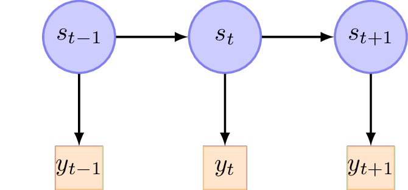

# 从EM算法到隐马尔科夫模型

## 0.极大似然估计
EM算法作为一种参数估计的算法，某种程度上可以看成是极大似然估计的扩展（当然它们也有明显区别，比如极大似然估计可以给出解析解，而EM算法只有基于迭代的数值解。）因此，有必要先了解一下极大似然估计。

先来对极大似然有一个感性的认识。假设有一枚不均匀的硬币，抛10次，8次正面，估计抛硬币出现正面的概率。

凭感觉就可以知道这个概率是0.8，其实这就是极大似然的思想。下面我们来细化我们的思路。

假定抛出正面的概率为$\theta$，那么抛出如题所述的这10次结果的概率为：

$$L(\theta)=P(8正|\theta)=\theta^8\cdot(1-\theta)^2$$

这个L就是似然函数。为了方便求导，我们对L取对数，得到对数似然函数LL，然后令LL的导数等于0，解得最优化的$\theta$。

$$LL(\theta)=logL(\theta)=8log\theta+2log(1-\theta)$$
$$\frac{dLL}{d\theta}=\frac{8}{\theta}-\frac{2}{1-\theta}=0 \Longrightarrow \theta=0.8$$

简单来说，每一组参数，都会对应一个观测结果出现的概率。极大似然估计，就是找出使得观测结果出现的概率最大的参数。
<br /><br />

## 1.EM算法

之所以说EM算法是极大似然估计的扩展，是因为EM算法其实就是一种用迭代的方法求解极大似然的方法，而且在这个过程中，允许有部分未知数据。
<br />

比如说，现在有两枚硬币A和B，首先随机地决定使用哪个硬币（用A或B的概率为1/2），然后抛这个硬币10次。重复这个实验5次，估计A和B出现正面的概率。

EM算法的步骤大概是这样，先给出一个A和B抛出正面的概率的初始值$\theta_A$和$\theta_B$，然后在已有观测序列X的情况下，计算出选用了A还是B的后验概率P(A|X)和P(B|X)，然后用极大似然估计求新的$\theta_A$和$\theta_B$。如此重复，直到结果收敛。步骤如下图。


<br />

首先是E步，我们以图中的第一次实验为例给出详细步骤。实验中抛出了5正5反，现在来计算P(A|X)。
$$\begin{aligned}
    P(A|X) &= \frac{P(A) \cdot P(X|A)}{P(X)} \\
    &= \frac{P(A) \cdot P(X|A)}{P(A) \cdot P(X|A) + P(B) \cdot P(X|B)} \\
    &= \frac{0.5 \times 0.6^5 \times 0.4^5}
    {0.5 \times 0.6^5 \times 0.4^5 + 0.5 \times 0.5^5 \times 0.5^5} \\
    &= 0.45
\end{aligned}$$

按照同样的方式计算其他的后验概率，之后就能简单地计算出A和B丢出正面和反面的数学期望了。

接着是M步，有了丢出正面和反面的数学期望，参考第0节求极大似然估计的内容，可以直接用正面期望除以总次数期望，得到更精确的抛出正面的概率的估计值，如上图。

如此反复，得到一个稳定的数值解，这就是EM算法的过程了。

<br />

形式化地来说，假定有可观测变量Y，隐变量Z，已知Y和θ的情况下的条件分布P(Z|Y,θ)，以及已知θ的联合分布P(Y,Z|θ)，则通过EM算法来估计参数θ的过程如下。

开始需要选择一个θ的初值，然后交替执行E步和M步。

E步：在拥有上一次迭代的参数θ的情况下，计算Q函数。（Q函数的由来就不讨论了）
$$\begin{aligned}
    Q(\theta,\theta^{(i)}) &= E_z[logP(Y,Z|\theta)|Y,\theta^{(i)}] \\
    &= \sum_{Z}logP(Y,Z|\theta)P(Z|Y,\theta^{(i)})
\end{aligned}$$

Q函数的定义是给定Y和$\theta^{(i)}$的情况下，$logP(Y,Z|\theta)$的期望，这个概率中的Z是自变量。

M步：类似于极大似然估计，求使Q函数极大化的θ作为新的参数估计值。
$$
    \theta^{(i+1)}=\arg\max_\theta Q(\theta, \theta^{(i)})
$$
<br />

在下面的隐马尔可夫模型中也会用到EM算法。

<br /><br />

## 2.隐马尔科夫模型
假定有一个随机序列，序列中的每一个随机变量只与序列中的上一个变量有关，则将这个序列称为一阶马尔可夫链。变量在时刻n的取值称为在n时刻的状态。所有可能的取值构成状态集合。我们一般研究齐次马氏链，所谓齐次是指，状态的转移概率平稳，不随时刻的变化而变化。


<br />

隐马尔科夫模型（Hidden Markov Model, HMM）也是关于时序的概率模型。该模型有一个隐藏的马尔可夫链，用来产生隐藏的状态序列，然后经由每一个状态，生成观测序列。



具体来说,如果有状态序列I，观测序列O，运用隐马尔可夫模型，会有一个状态集合Q，观测集合V，状态转移矩阵A，观测概率矩阵B，以及初始状态概率向量$\pi$。

状态序列I由初始状态$\pi$和状态转移矩阵A生成，观测序列O由状态序列I和观测概率矩阵B生成。因此，可将隐马尔可夫模型表示为一个三元组。
$$\lambda=(A,B,\pi)$$

运用HMM时，有三个基本问题：

1. 评估问题（Evaluation）: 给定一个HMM模型$\lambda$和观测序列O，计算条件概率P(O|λ)。
2. 解码问题（Decoding）: 给定一个HMM模型$\lambda$和观测序列O，求最可能的状态序列I。
3. 学习问题（Learning）: 给定观测序列O，学习模型$\lambda$的参数，使得P(O|λ)最大。

<br />

前两个问题可以用动态规划来接，第三个问题就会用到之前讨论的EM算法。我们一个一个地来看。

<br /><br />

### 1. 概率计算
直接用分情况计算概率然后求和的方法，需要枚举状态序列，可能性是指数增长的，计算效率无法接受。因此，换用动态规划的前向-后向算法。

先梳理一下过程中用到符号。

状态集合的大小为N，$Q=\{q_1,q_2,\dots,q_N\}$。

观测集合的大小为M，$V=\{v_1,v_2,\dots,v_N\}$。

状态转移矩阵为A，$A(q_i,q_j)$表示从状态$q_i$转移到状态$q_j$的概率。

观测概率矩阵为B，$B(q_i,v_j)$表示在状态为$q_i$时，产生观测值$v_j$的概率。

状态序列为I，长度为T，$I=(i_1,i_2,\dots,i_T),i_t\in Q$

观测序列为O，长度与状态序列相同，$O=(o_1,o_2,\dots,o_T),o_t\in V$

<br />

我们定义前向概率，给定一个HMM模型λ，到时刻t为止的观测序列$O_t=(o_1,o_2,\dots,o_t)$，且当前状态为$i_t=q_i$的概率即为前向概率。

$$\alpha_t(i)=P(o_1,o_2,\dots,o_t,i_t=q_i|\lambda)$$

首先，当t=1时，是平凡的，我们可以直接确定。

$$\alpha_1(i)=\pi_iB(q_i,o_1), \;\;i=1,2,\dots,N$$

<br />

接下来是递推的过程，在时刻t，前向概率的递推公式为：
$$\alpha_{t+1}(i)=\left[\sum_j\alpha_t(j)A(q_j,q_i)\right]B(q_i,o_{t+1}), \;\;i=1,2,\dots,N$$

<br />

对时刻T时的所有可能的状态的前向概率进行加总，得到P(O|λ).
$$P(O|\lambda)=\sum_i\alpha_T(i)$$

可以明显的可以感觉到有一个动态规划的过程，假定有动态规划的数组dp，dp[t][i]即为$\alpha_t(i)$，通过递推从左至右，从上到下的填满整个dp数组。

<br />

后向算法的过程类似，可以求出后向概率$\beta_t(i)$。利用α和β，可以求一些有用的概率。比如：

1. 给定模型λ和观测序列O，时刻t的状态为$q_i$的概率
$$\begin{aligned}
    \gamma_t(i)&=P(i_t=q_i|\lambda,O)\\
    &=\frac{P(i_t=q_i,O|\lambda)}{P(O|\lambda)} \\
    &=\frac{\alpha_t(i)\beta_t(i)}{P(O|\lambda)}
\end{aligned}$$

2. 给定模型λ和观测序列O，时刻t的状态为$q_i$且时刻t+1的状态为$q_j$的概率
$$\begin{aligned}
    \xi_t(i,j)&=P(i_t=q_i,i_{t+1}=q_j|\lambda,O) \\
    &=\frac{P(i_t=q_i,i_{t+1}=q_j,O|\lambda)}{P(O|\lambda)} \\
    &=\frac{\alpha_t(i)A(q_i,q_j)B(q_j,o_{t+1})\beta_{t+1}(j)}{P(O|\lambda)}
\end{aligned}$$

<br /><br />

### 2. 解码
解码问题也可以用动态规划来解决，这里叫做维特比算法（Viterbi）。解码问题实际上是根据观测序列，求出一条最有可能的状态序列的路径（最优路径）。

其思想是这样，求得时刻t之前的最优路径后，递推地求时刻t+1之前的最有路径，递推到时刻T时，则求得整体的最优路径。

仍用上一小节的符号，先定义两个变量：
1. 时刻1到时刻t的所有路径中，在时刻t的状态为$q_i$的路径中概率的最大值为
   $$\delta_t(i)=\max_{i_1,i_2,\dots,i_{t-1}}P(i_t=q_i,i_{t-1},\dots,i_1,O_t|\lambda), \;\;i=1,2,\dots,N$$
2. 时刻1到时刻t的所有路径中，在时刻t状态为$q_i$的路径中概率最大的路径的t-1个结点为
   $$\Psi_t(i)=\arg\max_{1\leqslant j \leqslant N}\left[\delta_{t-1}(j)A(q_j,q_i) \right], \;\;i=1,2,\dots,N$$

δ用于选择路径，ψ用于找出具体的路径节点。

<br />

维特比算法的过程如下。

与前向算法一样，先初始化δ和ψ，在时刻t=1的情况。
$$\delta_1(i)=\pi_iB(q_i,o_1), \;\;i=1,2,\dots,N$$
$$\Psi_1(i)=0, \;\;i=1,2,\dots,N$$

然后进行递推，递推公式如下：
$$\delta_t(i)=\max_{1\leqslant j \leqslant N}\left[\delta_{t-1}(j)A(q_j,q_i) \right]B(q_i,o_t), \;\;i=1,2,\dots,N$$
$$\Psi_t(i)=\arg\max_{1\leqslant j \leqslant N}\left[\delta_{t-1}(j)A(q_j,q_i) \right], \;\;i=1,2,\dots,N$$

设最后求出的最优路径为$I^*=(i_1^*,i_2^*,\dots,i_T^*)$，则最优路径的概率$P^*$和最优路径的最后一个节点$i_T^*$为
$$P^*=\max_{1\leqslant i \leqslant N}\delta_T(i)$$
$$i_T^*=\arg\max_{1\leqslant i \leqslant N}\delta_T(i)$$

利用ψ，可以逐步回溯，求出完整最优路径。
$$i_t^*=\Psi_{t+1}(i_{t+1}^*), \;\;t=T-1,T-2,\dots,1$$

### 3. 参数估计
待续

## 3.编程实现
待续
```python
pass
```
<br /><br />


（本文同时发布在[知乎专栏](https://zhuanlan.zhihu.com/p/46160757)）

--------------
## 参考文献：
1. [What is the expectation maximization algorithm?](http://ai.stanford.edu/~chuongdo/papers/em_tutorial.pdf)
2. [【深度剖析HMM（附Python代码）】 --CSDN](https://blog.csdn.net/tostq/article/details/70846702)
3. 李航. 统计学习方法[M]. 清华大学出版社, 2012
4. [Markov chain - Wikipedia](https://en.wikipedia.org/wiki/Markov_chain)
5. [The Basic of Hidden Markov Model](https://sambaiga.github.io/2017/05/03/hmm-intro.html)

